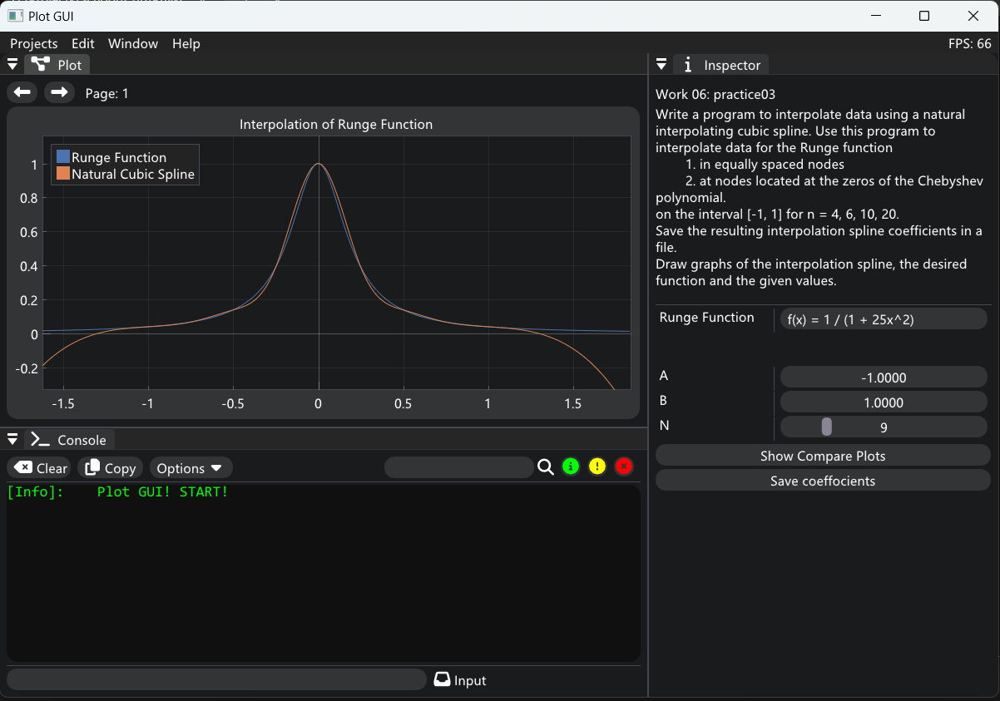
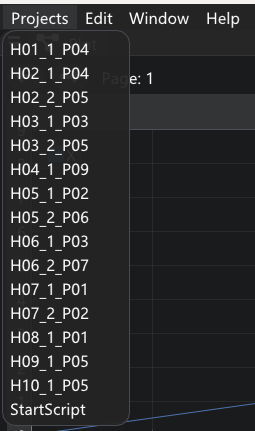

# PlotGUI

*A real-time, interactive, programmable 2D drawing software for custom tasks.*



## Description

PlotGUI is a real-time, interactive, programmable 2D drawing software for custom tasks.
This project provides some examples of numerical calculations, displays numerical results graphically, and analyzes key information on numerical calculations such as performance and convergence.

## Features

- Only supports **Windows** platform. The window interface is based on windows, and GUI rendering is based on **DirectX11**, so only the corresponding version of Windows is supported.
- Compile by C++17. Config and build by cmake (version >= 3.15).
- A variety of **2D** interactive plots can be realized. 3D plots are not supported.
- The GUI has **Plot**, **Console**, and **Inspector** panels, which can display plots information, parameter information, and print information.
- Supports class **reflection** (requires manual registration of fields), making it easier to add different tasks to the program.
- Supports **multi-threading** and realizes asynchronous operations of calculation and drawing.

## Tasks

Tasks are written in the folder ```./PlotGUI/Scripts```.

Different task prefixes represent different task categories. The following are the mathematical problems corresponding to the task prefixes:

- **H01**: System of linear equations
- **H02**: Iterative method
- **H03**: Eigenvalue solution
- **H04**: Solve equations
- **H05**: Optimize
- **H06**: Interpolation
- **H07**: Integral equation
- **H08**: Cauchy problem for ODE
- **H09**: Boundary value problems for ODE
- **H10**: Boundary value problems for PDE
- **H11**: Non-stationary problems in mathematical physics

## Usage

1. For MinGW users: 
   Run  ```  ./MinGWConfigBuild.bat  ``` . To 3.

2. For Visual Studio 2022 (MSVC) users: 
   Run  ```  ./VS2022ConfigBuild.bat  ``` . To 4.

3. For MinGW users: 
   Run   ```  ./Run_MinGW.bat  ``` . Then the program will start.

4. For MSVC users: 
   Run   ```  ./Run_MSVC.bat  ``` . Then the program will start.

5. The project entered by default is StartScript. If you want to directly enter the specified project, you can use the command line:

   ```powershell
   ./<build_dir>/PlotGUI.exe <project_name>
   ```

6. Or, you can select the task from "Projects" in the menu bar after entering the program.
   
   
   
7. Now, you can work on the Plot and Inspector panels.

## Third Party

- **ImGui**
- **ImPlot**
- **Json**

## License

PlotGUI is licensed under the MIT license. For more details, see the [LICENSE](LICENSE) file in the repository. 